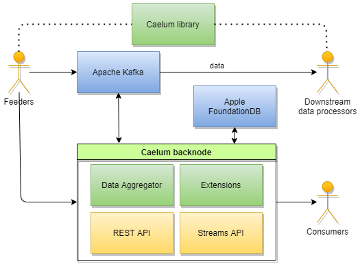

.. _arch:

*******************
Архитектура системы
*******************

.. contents::
    :local:
    :depth: 2

**Caelum** - это связующее программное обеспечение, ориентированное на обработку сообщений. Связующее означает,
что **Caelum** не определяет источники входных данных и потребителей выходных, а используется в качестве
промежуточного сервисного слоя в составе более сложных систем. Иначе говоря, **Caelum** обрабатывает входящие данных
не заботясь о том, откуда они поступают и отвечает на запросы, не спрашивая для каких целей нужны получаемые данные.
Механизмы интеграции **Caelum** с другим программным обеспечением являются неотъемлемой частью системы и подробно
рассматриваются в соответствующих разделах документации.

Архитектура **Caelum** нацелена на гибкость, отказоустойчивость, масштабируемость и расширяемость. Для этих целей
система разделена на несколько слабо связанных между собой компонентов.

Apache Kafka
------------

`Apache Kafka <https://kafka.apache.org/>`__ - это платформа распределенной потоковой обработки сообщений.
Эта технология обладает массой преимуществ и прекрасно подходит для решения задач обработки большого количества
записей в реальном времени. Apache Kafka поддерживает транзакции, что необходимо для работы критически важными
данными. В **Caelum** Apache Kafka используется как основное хранилище данных, протокол передачи данных и
механизм распределения нагрузки. Доступ к Apache Kafka является обязательным условием для запуска и работы
**Caelum**.

Apache Kafka реализует `publish-subscribe <https://en.wikipedia.org/wiki/Publish%E2%80%93subscribe_pattern>`__ 
паттерн. В рамках кластера определяются условные категории данных, которые называются темами (*topics*).
Поставщики данных направляют сообщения на сервер с указанием темы, к которой относится данное сообщение.
При получении нового сообщения, Apache Kafka перенаправляет его всем зарегистрированным наблюдателям
указанной темы. При этом, сообщение в течение определенного времени хранится на сервере. Срок хранения зависит
от конфигурации темы и может быть достаточно большим. Это свойство Apache Kafka используется **Caelum** для
организации условно постоянного хранения данных.

**Caelum** использует Apache Kafka и организует обработку сообщений нескольких категорий: пунктов, кортежей и
событий. В кластере Apache Kafka эти данных размещаются в разных темах. Сервисные узлы **Caelum** получают
сообщения из определенных тем, обрабатывают их и направляют обработанные данные в другие темы. Это позволяет
**Caelum** полностью абстрагироваться от источников данных и специфики реализации механизмов получения этих
данных. То же самое касается и получателей данных - **Caelum** формирует поток исходящих сообщений, который
может быть востребован другими подсистемами, специфика реализации которых не оказывает влияния на функционал
**Caelum**.

Apache Kafka предоставляет обширные возможности для настройки сообщений темы. Например, все сообщения
из темы пунктов по умолчанию хранятся 10000 лет. Если этот срок хранения не подходит, то его можно изменить
путем конфигурирования характеристик темы Apache Kafka. Распределение данных между серверами выполняется путем
разбивки на разделы (*partitions*). В случае, если **Caelum** оперирует большим количеством символов, следует
увеличить количество разделов, что бы обеспечить более плавное распределение нагрузки по разным сервисным
узлам **Caelum** и данных по разным серверам Apache Kafka. Это также достигается путем изменений характеристик
темы средствами конфигурации Apache Kafka. Все это позволяет гибко настраивать **Caelum** под конкретные
условия, не внося изменений в исходный код программы.

Следует отметить пару особенностей Apache Kafka, которые имеют значение в рамках системы **Caelum** и в
некоторых случаях могут оказывать влияние на принятие решения о ее использовании.

Во-первых, если рассматривать топик Apache Kafka как хранилище данных, то важно учитывать, что эта структура
представляет собой поток записей без возможности вставки в середину и какой либо сортировки (*append-only*).
**Caelum** использует топик пунктов как базу данных и это значит, что выдавать записи он будет в порядке их
поступления. В большинстве случаев это не представляет проблему - данные, относящиеся к отдельному символу
поступают в порядке возникновения и таким образом уже упорядочены по времени. Однако, в некоторых случаях
подача данных, которая зависит от реализации фидера, может осуществляться с нарушением очередности и это может
создавать проблему при чтении (следует отметить, что на кортежи эта проблема не распространяется). Учитывая
огромный поток данных, на который рассчитана система, выполнять дополнительную сортировку на стороне **Caelum**
или использовать еще одно хранилище данных не выглядит рациональным решением. Таким образом, важно учитывать
этот момент и если есть вероятность подачи в топик пунктов рассогласованных по времени критических данных
и этот риск не удается нивелировать на фидере, то от использования **Caelum** следует воздержаться.

Теперь хорошие новости. Второй особенностью Apache Kafka является архитектура потоковых приложений, которая позволяет
восстанавливать состояние системы используя только потоки входящих сообщений. То есть, продублировав топики пунктов
и событий на резервный кластер или выполнив бэкап данных топиков в виде файловых архивов, можно быть уверенным в
возможности полного восстановления системы путем повторной подачи содержимого этих топиков на новом кластере. 

Для работы **Caelum** понадобится как минимум один сервер Apache Kafka. Минимальная настройка **Caelum** для доступа
к кластеру Apache Kafka до смешного проста - необходимо указать адрес и порт сервера. **Caelum** автоматически
создает необходимые темы и подписывается на прослушивание новых сообщений этих тем. При необходимости, параметры
тем и конфигурация наблюдателей могут быть тонко подстроены путем изменений конфигурации сервисного узла **Caelum**.
Для более детальной информации обратитесь к разделу :ref:`Конфигурация <config>`.

Apple FoundationDB
------------------

`Apple FoundationDB <https://www.foundationdb.org/>`__ - это высопопроизводительная, распределенная база данных
типа ключ-значение. FoundationDB используется в тех случаях, когда нужен быстрый доступ к упорядоченным данным,
доступ по ключу и работа с диапазонами ключей. FoundationDB поддерживает транзакции, что позволяет обеспечивать
должный уровень согласованности данных. **Caelum** использует FoundationDB для хранения каталогов символов,
категорий и событий. Доступ к FoundationDB является обязательным условием для запуска и работы **Caelum**.

FoundationDB не просто позволяет обращаться к данным по определенному ключу, но и работать с диапазонами ключей.
Достигается это возможностью определять многосоставные ключи и таким образом объявлять пространства ключей. При
этом, начальная часть ключа определяет путь к пространству, а финальная часть указывает на элемент в этом
пространстве. Таким образом, в рамках одной базы данных FoundationDB можно хранить граф элементов (по аналогии с
каталогами и файлами на диске). Путь к элементу графа определяется идентификаторами пространств в порядке
перечисления от корня к элементу. Внутри пространства ключи автоматически сортируются в порядке возрастания.
Благодаря этому, становится возможным организовать данные таким образом, что бы получать предсказуемый порядок
записей при выборке из диапазонов. Этот механизм используется **Caelum** для работы со списками категорий,
символов и событий, для которых критически важен порядок получения.

Для работы **Caelum** понадобится как минимум один сервер FoundationDB. База данных FoundationDB должна быть
инициализирована до запуска **Caelum**. Никаких специфических настроек FoundationDB для работы **Caelum** не
требуется. При необходимости, кластер FoundationDB может быть тонко настроен для обеспечения максимальной
надежности и производительности. Для доступа к FoundationDB в конфигурации **Caelum** предусмотрен параметр,
объединяющий адрес сервера и порта подключения. Для более детальной информации о параметрах конфигурации
FoundationDB обратитесь к разделу :ref:`Конфигурация <config>`.

Docker
------

`Docker <https://www.docker.com/>`__ - это платформа контейнеризации, доставки и развертывания приложений.
Docker позволяет упаковывать приложения в образы и распространять их в виде файлов или через репозиторий.
Docker хорошо документирован и установка его на сервер, как правило, не вызывает сложностей. Использование
этой платформы избавляет от рутинной работы по установке зависимостей и настройке приложений, доступных в
виде образов.

Docker сервер использует образы для запуска контейнеров приложений. Контейнеры приложений выполняются в
изолированной среде, что само по себе хорошо в плане защиты приложения от внешних атак и ошибок других
приложений. Как правило, доступ к контейнерам осуществляется посредством сетевых соединений на адреса
публичных портов, явно заданных при конфигурации контейнера. Другой способ взаимодействия с контейнером
- это работа с общими томами, которые отражаются на файловую систему контейнера и файловую систему сервера
Docker. Большинство образов позволяют задавать ключевые параметры работы путем определения переменных
окружения, которые могут быть переданы в контейнер при его запуске. Кроме этого, утилита
`docker-compose <https://docs.docker.com/compose/>`__ позволяет запускать несколько связанных между собой
контейнеров, что идеально подходит для запуска тестовой лаборатории или однохостового сервера **Caelum**.

Docker не является обязательным для запуска и работы **Caelum** - любой компонент может быть запущен вручную
или иным автоматизированным способом доставки и развертывания. Однако, **Caelum** рассматривает Docker в
качестве основной платформы контейнеризации. Проект содержит инструкции и скрипты, необходимые для сборки
образов и настройки контейнеров приложений, входящих в состав системы или необходимых для ее работы.

Библиотека Caelum
-----------------

Библиотека Caelum (*Caelum library*) - это набор общих программных компонентов, написанных на языке Java и
предназначенных для реализации специфических подсистем таких как фидеры, потребители и потоковые обработчики.
В библиотеку включены классы модели, сериализаторы и десериализаторы записей соответствующих топиков Apache
Kafka, объявлены интерфейсы расширений, сервисов и т.п. Библиотека нацелена на сокращение стоимости и сроков
интеграции, содержит хорошо протестированный код и гарантирует максимальную совместимость с будущими версиями.

Фидеры
------

Фидер (*feeder*) - это компонент, обеспечивающий подачу данных в систему **Caelum**. Как отмечалось выше, в
**Caelum** источники данных вынесены за пределы системы. Благодаря такой декомпозиции, cистема избавляется от
специфики источника данных. Например, провайдер данных может быть привязан к определенной операционной системе
в виду использования проприетарных библиотек. Или же существуют аппаратные ограничения по месту работы
програмного обеспечения, подключаемого к источникам данных. Или необходимо подавать данные из нескольких
разнородных источников. **Caelum** учитывает подобные ситуации и предлагает способы их решения посредством
системы фидеров.

Разработка фидера на языке Java процесс не сложный. Для этого используется Kafka Producer API, с помощью
которого сообщения представляющие пункты и события будут направляться в кластер Kafka. При использовании
библиотеки **Caelum** код непосредственной подачи данных сводится буквально до нескольких строк. Более
подробную информацию о разработке фидеров можной найти в :ref:`соответствующем разделе <feeders>`
документации.

Сервисные узлы
--------------

Сервисный узел (*backnode*) представляет собой основную рабочую единицу системы. Сервисные узлы обеспечивают
обработку данных и предоставляют доступ к данным посредством высокоуровневого API. Помимо этого,
каждый узел предоставляет доступ к просмотру и изменению данных посредством веб интерфейса, который называется
консоль Caelum.

.. note:: 
    Консоль Caelum реализована на языке JavaScript, использует Caelum :ref:`REST API <rest_api>`
    и может послужить наглядным примером использования системы.

Достаточно запустить хотя бы один сервисный узел для того, что бы **Caelum** начал выполнять свою работу по
обработке данных. Одного узла недостаточно для того, что бы обеспечить высокий уровень надежности, но подобная
конфигурация позволяет запустить систему в полностью функциональном режиме всего на одной машине.

В случае запуска нескольких узлов, работа по обработке данных автоматически распределяется между всеми узлами.
При запросах данных не важно к какому узлу обращаться - все узлы одноранговые и возвращают существующие в
системе данные независимо от того, каким конкретно узлом эти данные были обработаны. Единственная разница
между узлами заключается в выдаче служебной информации о сосотоянии узла, которая по очевидным причинам будет
описывать непосредственно тот узел, к которому выполняется обращение.

Сервисный узел включает в себя несколько подсистем, которые гибко настраиваются через конфигурационный файл
вплоть до отключения подсистемы, если ее функционирование не требуется. Детальное описание параметров
конфигурации можно найти в разделе :ref:`Конфигурация <config>`.

Функционал сервисного узла может быть дополнен посредством расширений. Расширение - это програмный модуль,
разработанный на языке Java и запускаемый в работу вместе с сервисным узлом. Расширения получают доступ к
сервисному интерфейсу узла и посредством этого интерфейса могут взаимодействовать с основными подсистемами.
Несколько важных функций **Caelum** также реализованы в виде расширений. Более подробную информацию о
разработке расширений можно найти в разделе :ref:`Расширения <extensions>`.

Потоковые приложения
--------------------

**Caelum** - это сервис потоковой обработки данных. Это значит, что он обрабатывает некий входной поток
данных и формирует выходной. Другие приложения могут использовать выходные потоки данных **Caelum** для своих
целей (*downstream data processing*), формировать собственные выходные потоки, которые, в свою очередь, будут
востребованы другими приложениями. Возможность создания цепочек обработчиков на основе выходных потоков
данных различных приложений является одной из важнейших целей системы.

Новые потоковые приложения могут быть разработаны с помощью Kafka Streams API и интегрированы в сервисные
узлы посредством механизма расширений. Библиотека Caelum предоставляет весь необходимый функционал для
работы с выходными потоками системы **Caelum**: пунктами, кортежами и событиями. Более детальную информацию
о разработке потоковых приложений и их интеграции с **Caelum** можно найти в разделе :ref:`Потоковые
приложения <streamproc>`.

Потребители
-----------

Потребителями (*consumers*) являются любые приложения, которые используют данные **Caelum** в своей работе.
Потоковые приложения, описанные в предыдущем разделе также являются потребителями. Однако, в данном разделе
речь пойдет только о тех потребителях, которые для получения данных используют высокоуровневые API.

**Caelum** предлагает приложениям-клиентам высокоуровневый REST API, который может быть использован для
получения данных о любых учитываемых объектах: категориях и символах, пунктах, кортежах и событиях. REST API
базируется на протоколе HTTP, принимает HTTP-запросы и возвращает данные в простом и понятном текстовом
формате JSON. Детальное описание протокола обмена данными находится в разделе :ref:`REST API <rest_api>`
документации.

Для отслеживания изменений в реальном времени предназначен другой высокоуровневый интерфейс - Web Socket
Streams (*WSS*). WSS позволяет подписываться на любые обновления символа: пункты, кортежи и события. При
появлении новых данных по подписанным символам, подключеные по Web Socket клиенты будут получать уведомления
вместе с поступившими данными. 

Высокоуровневые API **Caelum** позволяют реализовывать код клиентских приложений на любом языке
программирования: от JavaScript до C++. Комбинируя REST API и Web Socker Streams, клиентские приложения могут
оперировать максимально актуальной информацией, быстро реагировать на возникающие изменения, потребляя при этом
минимальный объем трафика. Более подробную информацию о разработке клиентских приложений можно найти в разделе
:ref:`Интеграция с клиентами <clients>`.
