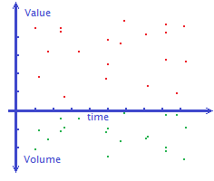
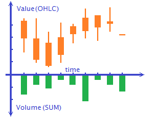
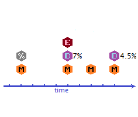

.. _basics:

****************
Основные понятия
****************

.. contents::
    :local:
    :depth: 2

**Caelum** - это система сбора, хранения и анализа статистических данных. **Caelum** собирает факты нескольких типов
и формирует из них временные ряды, пригодные для последующего использования в качестве источника исторических данных,
для визуализации, прогнозирования динамики показателей или автоматизации принятия решений. В данном разделе
рассматриваются предметная область и элементы модели данных **Caelum**.

Пункты
------

 
    Пример визуализации временного ряда пунктов.
 
Факты, фиксирующие значения числовых показателей в определенный момент времени в системе **Caelum** называются пунктами
(*items*). В околобиржевой среде эти данные более известны как тики или тиковые данные. Однако, **Caelum** стремится
абстрагироваться от узкоспециализированных отраслей и по этому мы будем называть их пунктами. Каждый пункт
характеризуется парой числовых значений: качественным и количественным показателями. С каждым моментом времени могут
быть связаны ноль, один или несколько пунктов. Совокупность всех пунктов образует моментный временной ряд.

Что конкретно символизирует каждый отдельный пункт, полностью зависит от предметной области и поставленной задачи.
Это может быть торговая сделка, где качественный показатель выражает цену за единицу товара, а количественный
показатель - это количество сделки. Или значение определенного сенсора, где качественный показатель выражает
измерение с датчика в определенный момент времени. Или количество сообщений, полученных в процессе отдельного сеанса
с почтовым сервисом. В общем, это могут быть любые данные, которые можно выразить качественно или количественно и
которые необходимо собирать, хранить, получать и анализировать.

Важно понимать, что качественный и количественный показатели пунктов используются принципиально разными агрегатными
функциями для получения кортежей - интервального временного ряда, построенного на базе пунктов, в отношении которых
применены функции агрегирования данных. Если при подаче данных в систему неправильно определить характер показателя,
то можно получить неожиданный результат.

В системе **Caelum** Каждому моменту времени может соответствовать ни одного, один или несколько пунктов. Иными
словами, в системе могут быть несколько разных или даже одинаковых по показателям пунктов с одинаковым временем.
Это критично для тех систем, где первичным является факт, а не состояние в определенный момент времени. Например,
для фиксации торговых сделок, где несколько сделок могут быть выполнены одновременно. Или в системах мониторинга
программно-аппаратных комплексов, где в один момент времени могут поступать показатели из различных источников.

Кортежи
-------

 
    Пример визуализации интервального временного ряда кортежей.
 
**Caelum** автоматически подготавливает данные для более удобной обработки в виде интервальных временных рядов.
Все факты, фиксирующие значения числовых показателей с помощью агрегатных функций группируются в *OHLC+V*
кортежи, представляющие сводные данные за определенные равные промежутки времени.

*OHLC+V* буквально означает Open-High-Low-Close+Volume. Такой кортеж представляет собой группу значений
соответственно открытия, максимума, минимума и закрытия расчитанных на базе качественного показателя, а также сумму
значений количественного показателя для всех пунктов, входящих во временной интервал кортежа. Данный формат является
стандартом де-факто в индустрии биржевой торговли, активно используется при анализе рыночных данных и подходит для
любых данных в отношении которых применим анализ интервальных временных рядов. **Caelum** позволяет работать с
интервалами различной длины, начиная с минутных.

События
-------

 
    Пример визуализации временного ряда событий.

Факты, не имеющие численного выражения или не предназначенные для агрегирования называются событиями (*events*).
Тип события определяется целочисленным идентификатором, а значение - произвольной строкой. В отличии от пунктов,
на каждый момент времени может быть зарегистрировано только одно событие конкретного типа. События разных типов
группируются по времени и сохраняются в отдельном слоте, представляя собой состояние определенных характеристик в
конкретный момент времени. В технических выражениях, с определенным моментом времени связывается ассоциативный
массив, где целочисленные ключи - это типы событий, а значения - строки, более детально характеризующие событие
типа.

Совокупность событий образует временную последовательность, которая представляет собой историю обновлений
значимых характеристик. Например, даты выплаты дивидендов и суммы выплат на акцию, даты публикаций отчетов, даты
изменений процентной ставки по кредитам и ее новые значения и так далее. Рассматривать последовательность можно
с разных точек зрения в зависимости от потребностей. Если каждый слот событий представляет собой слепок всех
атрибутов объекта, то такую последовательность можно использовать для определения состояния объекта на конкретную
дату. Если же слоты содержат только те атрибуты, для которых произошло изменение, то такую последовательность
можно рассматривать как последовательность инкрементальных обновлений. Совмещая графики пунктов и событий или
кортежей и событий можно выявлять корелляции и делать выводы о том, как то или иное событие влияет на динамику
измеряемых показателей.

Символы и категории
-------------------

В предыдущих параграфах рассматривались данные в обобщенном виде, но не раскрывалось как **Caelum** работает с
номенклатурой. **Caelum** разработан с учетом того, что количество учетных единиц будет достигать десятков
тысяч, сотен тысяч или даже миллионов единиц.

Для логического разделения данных в **Caelum** используются символы (*symbols*). Символ это произвольная строка,
позволяющая идентифицировать номенклатурную единицу. В терминах базы данных, символ - это первичный ключ объекта
учета. Символом может быть тикер, идентификатор товара, идентификатор пользователя, компьютера или иного сенсора.
Символ является обязательным атрибутом в отношении пунктов, кортежей и событий. Это значит, что каждый пункт,
кортеж или событие связаны с одним и только одним символом. С другой стороны, наличие в системе символа не
означает, что с этим символом связаны пункты, кортежи или события. Каталог символов не связан жестко с учетными
данными может быть использован обособлено.

**Caelum** предполагает наличие большого количества символов. Для облегчения навигации по каталогу символов в
**Caelum** введено понятие категорий (*categories*). Также как и символы, категории представляются строковыми
идентификаторами, позволяющими группировать символы в отдельные группы по определенному признаку. Категория не
может быть назначена для символа явно. При обнаружении нового символа, **Caelum** с помощью специального алгоритма
автоматически определяет список категорий этого символа и создает соответствующие записи в каталогах символов и
категорий. Впоследствии, используя идентификатор категории можно делать выборки символов, объединенных по общему
признаку. А используя символ, можно делать выборки пунктов, кортежей и событий.
