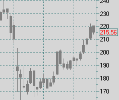

.. _index:

*****************
Что такое Caelum?
*****************

TODO: Решает нетривиальные задачи: значения произвольной длины и произвольной точности, в том числе для криптовалют
Компактное представление данных

TODO: Бенефиты

**Caelum** это отказоустойчивый, высокопропускной и масштабируемый агрегатор данных, предназначенный для сбора,
обработки и хранения больших объемов различных статистических данных таких, как результаты биржевых торгов и
аукционов, статистика продаж, данные мониторинга программных комплексов, данные сенсоров, телеметрия и т.п.
**Caelum** обрабатывает и сохраняет данные в виде разнотипных временных рядов (тики,
`OHLC <https://en.wikipedia.org/wiki/Open-high-low-close_chart>`__ агрегаты, связанные события), что позволяет
покрывать обширный диапазон вариантов использования: сбора, хранения, обработки, ретрансляции, отрисовки
графиков, анализа и прогнозирования.

**Caelum** не является приложением для конечных пользователей. Это промежуточное программное обеспечение
(middleware), имеющее архитектуру микросервиса и предназначенное для интеграции с другими программно-аппаратными
комплексами посредством API. Построенный на основе `Apache Kafka <https://kafka.apache.org/>`__ и
`Apple FoundationDB <https://www.foundationdb.org/>`__ **Caelum** обеспечивает быструю обработку и высокую
надежность хранения данных. Система ориентирована на работу с критически-важными данными, потеря которых может
привести к серьезным последствиям.

.. note::
    Мы прилагаем все усилия, что бы обеспечить максимальную надежность, но совокупная сложность системы и возможность
    гибкой настройки не позволяет давать каких-либо гарантий. Внимательно изучите систему и оцените все риски, прежде
    чем начать ее использование для решения критически-важных задач.

**Caelum** не требует множества серверов для запуска и работы: он может быть запущен как на
пользовательском компьютере, так и в составе большого кластера. Однако, следует понимать, что высокую надежность системы
можно получить только при определенной избыточности инфраструктуры. Прежде чем начать использование **Caelum** для
работы с критическими данными следует изучить архитектуру и принципы работы **Caelum**, а также убедиться в наличии
достаточного количества ресурсов для достижения требуемой надежности. **Caelum** гибко настраивается как под нужды,
так и под возможности, продиктованные наличием ресурсов.

Что бы понять какие цели были поставлены при разработке **Caelum**, легче всего рассмотреть первоначальный
вариант использования. В основе решения **Caelum** лежит задача работы с рыночными данными, такими как списки
биржевых инструментов, характеристики торгов в определенный момент времени, события, способные повлиять на
динамику котировок, информация о совершенных сделках, анализ динамики цены и объемов торгов и т.д. В общем,
**Caelum** разработан в качестве решения в случаях если есть:

- Тысячи источников данных и потребителей
- Десятки тысяч типов событий
- Миллиарды входящих событий в сутки
- Данные, время обработки которых критично в пределах миллисекунд
- Данные, потеря которых критична и наверняка приведет к принятию ошибочных решений
- Терабайты данных, которые необходимо хранить на протяжение многих лет

Несмотря на то, что первоначальный вариант использования - работа с биржевыми данными, в **Caelum** нет
привязки к какой-либо специализированной предметной области. **Caelum** оперирует достаточно абстрактными
общими понятиями, что позволяет избегать путаницы при использовании решения в рамках любых бизнес-задач,
для которых требуется быстрая и надежная обработка данных. **Caelum** может быть использован для целей
обработки сенсоров роботизированной фабрики, журналов DevOps или обслуживания IoT девайсов с таким же успехом,
как в обработке потоков финансовой информации.

Изучение следует начинать с раздела :ref:`Основные понятия <basics>`, в которой детально рассматривается
предметная область. О строении системы можно узнать в разделе :ref:`Архитектура системы <arch>`.
Информации об установке и настройке находится в разделе :ref:`Начало работы <getstart>`.
Полный обзор документации можно найти в разделе :ref:`Содержание <contents>`.
